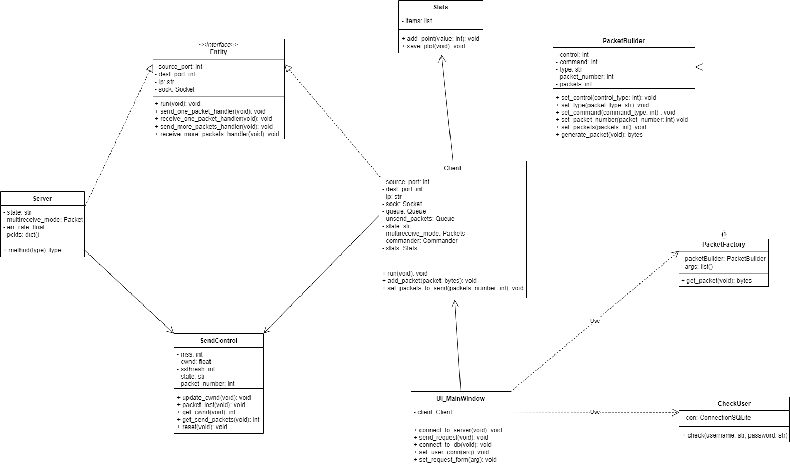
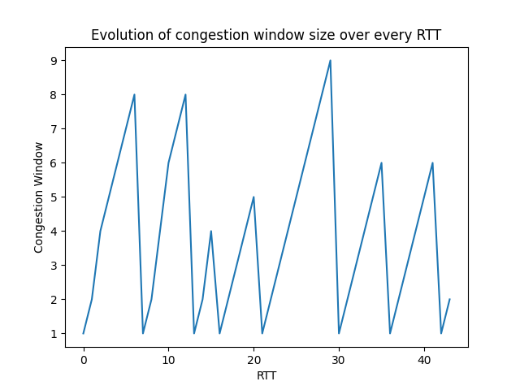

# Implementarea unui mecanism de control al congestiei. Aplicație demonstrativă (UDP)

Congestia unei rețele este o stare care apare atunci când traficul este atât de încărcat încât încetinește timpul de răspuns al acesteia. Cu alte cuvinte, prin rețea circulă mai multe date decât ar trebui.
Efectele acesteia sunt: întârzierile, pierderea pachetelor sau blocarea noilor conexiuni.
Controlul congestiei este un mecanism prin care se evită apariția acesteia.

## Protocolul UDP

UDP (User Datagram Protocol) este un protocol ce trimite pachete independente de date, numite datagrame, de la un calculator către altul, fără a garanta în vreun fel ajungerea acestora la destinație.   
Este un serviciu neorientat conexiune: nu se stabilește o conexiune între client și server. Așadar, server-ul nu așteaptă apeluri de conexiune, ci primește direct datagrame de la clienți.   
Este întâlnit în sistemele client-server în care se transmit puține mesaje și în general prea rar pentru a menține o conexiune activă între cele două entități.   
Nu se garantează ordinea primirii mesajelor și nici prevenirea pierderilor pachetelor. UDP-ul se utilizează mai ales în rețelele în care există o pierdere foarte mică de pachete și în cadrul aplicațiilor pentru care pierderea unui pachet nu este foarte gravă (ex. Aplicațiile de streaming video).  

## Gestionarea congestiei

Protocolul UDP este orientat pe trimiterea pachetelor și nu este orientat pe conexiune, așa cum se întâmplă în cazul protocolului TCP.  
În cadrul protocolului TCP, există o serie de algoritmi care tratează apariția congestiei. Printre aceștia, amintim: Tahoe, Reno, New Reno și Vegas.  
Aplicația va implementa funcționalitatea algoritmului _Tahoe_ pentru transmisia pachetelor folosind UDP într-o arhitectură de tip **client-server**.

## Algoritmul Tahoe

Algoritmul Tahoe a fost numit după un lac din Statele Unite ale Americii. Acest algoritm particular a fost dezvoltat în acea zonă, de unde a rezultat numele.  
Stările algoritmului sunt: **Slow Start**, **AIMD** și **Fast Rentransmit**.  
**Starea Slow Start**: Starea este activă până când dimensiunea ferestrei (_cwnd_) devine egală cu _sshtresh_.
În această fază, dimensiunea ferestrei se dublează la fiecare segment de date trimis și recepționat (_RTT_).
Atunci când cwnd atinge valoarea lui sshtresh, starea încetează și cedează locul stării **AIMD**. 

**Starea AIMD**: În această fază _cwnd_ crește după formula **CWND = MSS * MSS / CWND**, unde _MSS_ este dimensiunea maximă a unui segment.
În același timp, _sshtresh_ va fi redus la jumătate din valoarea curentă a _cwnd_. 

**Starea Fast Retransmit**: În momentul în care se primesc trei pachete duplicate ca răspuns, algoritmul trece în această fază.
Aici valoarea _cwnd_ este setată la 1, apoi se va relua transmisia pachetelor în starea **Slow Start**.

## Configurarea server-ului

Configurarea unui server se realizează prin specificarea adresei IP și a portului sursă. Acestea trebuie să fie cunoscute și de clientul ce dorește să se conecteze.

## Stabilirea conexiunii către server

1. Conexiunea se realizează prin specificarea adresei IP, a portului sursă (client) și a portului destinație (server).
2. După stabilirea parametrilor de comunicare, se va realiza conectarea la baza de date și validarea utilizatorului ce dorește să folosească interfața.
3. Apoi, interfața devine activă iar utilizatorul poate trimite și recepționa pachete de la server.

## Formatul pachetelor ce vor fi trimise

Pentru început, orice pachet va fi format din 8 biți în care se va stoca tipul controlului dorit.

| Tip control | Cod |
|-------------|-----|
| CONNECTION  | 0   |
| INSTRUCTION | 1   |
| RESPONSE    | 2   |

Pe următorii 8 biți, se va salva tipul comenzii ce se dorește a fi executată, în cadrul pachetului tip INSTRUCTION sau care a fost executată, în cadrul pachetului de tip RESPONSE.

| Nume comandă  | Cod |
|---------------|-----|
| LIST_FILES    | 0   |
| CREATE_FILE   | 1   |
| APPEND_FILE   | 2   |
| REMOVE_FILE   | 3   |

Dacă pachetul este de tip CONNECTION, octetul va conține următoarele tipuri de notificări:

| Nume notificare | Cod |
|-----------------|-----|
| ACK             | 0   |
| LEAVE           | 1   |
| OVER            | 2   |

## Structura pachetelor prin care se va realiza comunicarea

Pentru pachetul ce va cere __afișarea fișierelor__, __finalizarea transmisiei__ sau __deconectarea de la server__, structura este:

| COD_INSTRUCȚIUNE | COD_COMANDĂ |
|------------------|-------------|
| 8 BIȚI           | 8 BIȚI      |

Pentru pachetul ce va cere __adăugarea unui fișier__ sau __ștergerea unui fișier__, structura este:

| COD_INSTRUCȚIUNE | COD_COMANDĂ | NUME_FIȘIER |
|------------------|-------------|-------------|
| 8 BIȚI           | 8 BIȚI      | x BIȚI      |

Pentru pachetul ce va realiza __adăugarea de conținut__, __descărcarea unui fișier__ sau __încărcarea unui fișier__, structura este:

| COD_INSTRUCȚIUNE  | COD_COMANDĂ | NUMĂR_PACHET_CURENT | NUMĂR_PACHETE |  NUME_FIȘIER | CONȚINUT_PACHET |
|-------------------|-------------|---------------------|---------------|--------------|-----------------|
| 8 BIȚI            | 8 BIȚI      | 8 BIȚI              | 8 BIȚI        |  x BIȚI      | 1 - 512 BIȚI    |

Pentru pachetul ce va realiza __confirmarea datelor__, structura este:

| COD_INSTRUCȚIUNE | COD_COMANDĂ | NUMĂR_PACHET_URMĂTOR |
|------------------|-------------|----------------------|
| 8 BIȚI           | 8 BIȚI      | 8 BIȚI               |

## Operatii implementate

Folosind structura pachetelor definită mai sus, aplicația va implementa următoarele operații:
- crearea unui fișier
- adăugarea de conținut la un fișier
- ștergerea unui fișier

Amintim că mecanismul de control al congestiei folosind Algoritmul Tahoe se va realiza doar în cazul celei de a doua operații, în care conținutul ce se dorește a fi adăugat va fi împărțit în pachete ce vor fi transmise către server.

## Paradigme de programare folosite

În implementarea aplicației, a fost folosită paradigma programării orientate pe obiecte, dar și elemente de programare funcțională. 

Aplicația utilizează mai multe șabloane de proiectare:
- Constructor (Builder) - pentru crearea pachetelor;
- Fabrică de obiecte (Factory) - pentru formatarea pachetelor în funcție de operația realizată;
- Comandă (Commander) - pentru realizarea operațiilor de răspuns ale server-ului după primirea unui pachet;
- Automat cu stări finite (Finit State Machine) - pentru gestionarea congestiei, folosit de Client și Server.

Diagrama UML de clase este următoarea:

## Rezultate

Mai jos, se află rezultatele obținute în urma transferului a 176 de datagrame, prin care s-a transportat conținutul unui fișier text,
în cadrul căruia server-ul a avut o rată de primire a pachetelor de 95%.

## Bibliografie

[1] TCP/IP Illustrated, Volume 2, W. Richard Stevens and Gary R. Wright, Addison-Wesley Professional 

[2] RFC 768, User Datagram Protocol, J. Postel, 28 August 1980 

[3] RFC 2914, Congestion Control Principles, S. Floyd, September 2000 

[4] RFC 5681, TCP Congestion Control, Purdue University, September 2009 